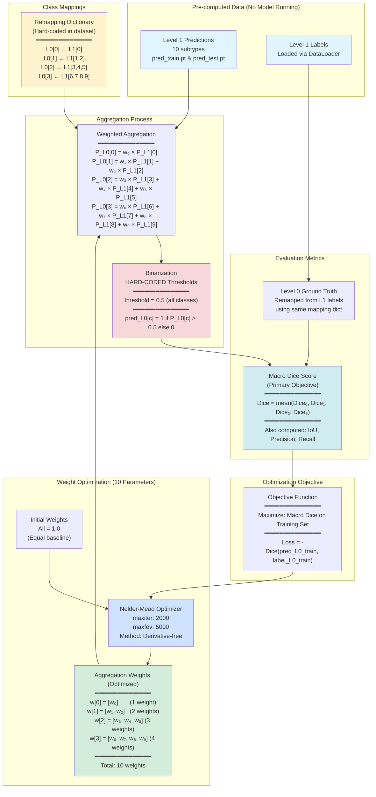

# Weighted Aggregation Evaluation Workflow

## Overview

This workflow evaluates different strategies for aggregating **Level 1 subtype probabilities** into **Level 0 Gleason pattern predictions**. The key insight is that we have pre-computed Level 1 predictions (10 classes) and want to optimally combine them into Level 0 predictions (4 classes) without re-running the model.

## Key Insight: No Model Inference Required! ✓

**We use pre-computed predictions** stored in:
- `/home/f049r/checkpoints/full_data_test/version_8/preds/pred_train.pt` (914 samples)
- `/home/f049r/checkpoints/full_data_test/version_8/preds/pred_test.pt` (91 samples)

The model has already generated Level 1 subtype predictions. We only optimize how to aggregate them into Level 0.

---

## Complete Workflow Diagram



---

## Detailed Breakdown

### 1. Class Mappings (Fixed)

The mapping from Level 0 to Level 1 is **hard-coded in the dataset**:

```python
{
    0: [0],         # Background ← Background subtype
    1: [1, 2],      # Benign/GP3 ← Individual glands + Compressed glands
    2: [3, 4, 5],   # GP4 ← Cribriform + Fused + Glomeruloid
    3: [6, 7, 8, 9] # GP5 ← Solid sheets + Single cells + Necrosis + Stroma
}
```

### 2. Weights Being Optimized (10 Total)

**ALL 10 weights are optimizable**, including single-child classes:

| Level 0 Class | Level 1 Subtypes | # Weights | Weight Indices | Purpose |
|---------------|------------------|-----------|----------------|---------|
| 0 (Background) | [0] | 1 | w₀ | **Acts as implicit threshold adjustment** |
| 1 (Benign/GP3) | [1, 2] | 2 | w₁, w₂ | Balances individual vs compressed glands |
| 2 (GP4)        | [3, 4, 5] | 3 | w₃, w₄, w₅ | Balances cribriform vs fused vs glomeruloid |
| 3 (GP5)        | [6, 7, 8, 9] | 4 | w₆, w₇, w₈, w₉ | Balances solid sheets vs single cells vs necrosis vs stroma |
| **Total**      | | **10** | | |

**Why single-child weights matter:**
- Weight = 1.0 → effective threshold = 0.5
- Weight = 2.0 → effective threshold = 0.25 (easier to activate)
- Weight = 0.5 → effective threshold = 1.0 (harder to activate)

### 3. Hard-Coded Level 0 Threshold

```python
threshold_L0 = {0: 0.5, 1: 0.5, 2: 0.5, 3: 0.5}
```

**All Level 0 classes use threshold = 0.5**. This is fixed and not optimized.

### 4. Optimization Objective

**Maximize:** Macro Dice score on the **training set** (914 samples)

```python
Macro_Dice = mean(Dice_class_0, Dice_class_1, Dice_class_2, Dice_class_3)
```

**Method:** Nelder-Mead (derivative-free simplex method)
- Required because Dice is non-differentiable (hard threshold)
- Gradient-based methods (L-BFGS-B) fail with zero gradients

### 5. Evaluation Metrics

For each strategy, we compute on both train and test sets:

- **Macro Dice** (primary)
- **Macro IoU**
- **Macro Precision**
- **Macro Recall**
- **Per-class metrics** (Dice, IoU, Precision, Recall for each of 4 classes)

---

## Three Strategies Compared

### Strategy 1: Equal Weights (Baseline)
```python
weights = {0: [1.0], 1: [1.0, 1.0], 2: [1.0, 1.0, 1.0], 3: [1.0, 1.0, 1.0, 1.0]}
```
Simple averaging of subtype probabilities.

### Strategy 2: Threshold-Based Weights
Derived from optimal Level 1 thresholds using inverse threshold weighting:
```python
w_i = (1 - threshold_i) / mean(1 - threshold_j)
```
Lower threshold → higher weight (more sensitive → more important).

### Strategy 3: Optimized Weights
Directly optimize 10 weights to maximize training Dice score using Nelder-Mead.

---

## File Structure

```
GleasonXAI/
├── scripts/
│   ├── evaluate_weighted_aggregation.py    # Main evaluation script
│   ├── optimize_aggregation_weights.py     # Weight optimization module (FIXED)
│   └── evaluate_level0_metrics.py          # Metrics computation
├── jobs/
│   ├── submit_evaluate_weighted_aggregation.sh  # Job submission script
│   └── README_weighted_aggregation.md           # This file
└── /home/f049r/checkpoints/full_data_test/version_8/
    ├── preds/
    │   ├── pred_train.pt   # Pre-computed L1 predictions (914 samples)
    │   └── pred_test.pt    # Pre-computed L1 predictions (91 samples)
    └── weighted_aggregation_evaluation/
        ├── weighted_aggregation_results.json   # Results
        ├── weights_comparison.png              # Weight visualization
        └── performance_comparison.png          # Performance comparison
```

---

## What Changed (Bug Fix)

### Before (Bug):
```python
# Only 9 weights optimized - class 0 weight hardcoded to 1.0
if len(level1_classes) > 1:
    weights = weights_dict[level0_class]
    flat_weights.extend(weights)
```

### After (Fixed):
```python
# All 10 weights optimized - class 0 weight can be optimized
weights = weights_dict[level0_class]
flat_weights.extend(weights)
```

**Impact:** Class 0 weight can now adjust the effective threshold for background detection!

---

## Performance Note

**Each optimization iteration:**
- Aggregates 914 training samples: ~13-14 seconds
- With 2000 max iterations: Could take **7-19 hours**

**Recommendation:** Reduce to `maxiter=200-500` for faster convergence.

---

## Running the Job

```bash
# From bsub01.lsf.dkfz.de
cd /home/f049r/src/ProQuant-AI/GleasonXAI
bash jobs/submit_evaluate_weighted_aggregation.sh
```

Monitor:
```bash
bjobs                 # Check status
bpeek <JOB_ID>        # View live output
bkill <JOB_ID>        # Cancel if needed
```
